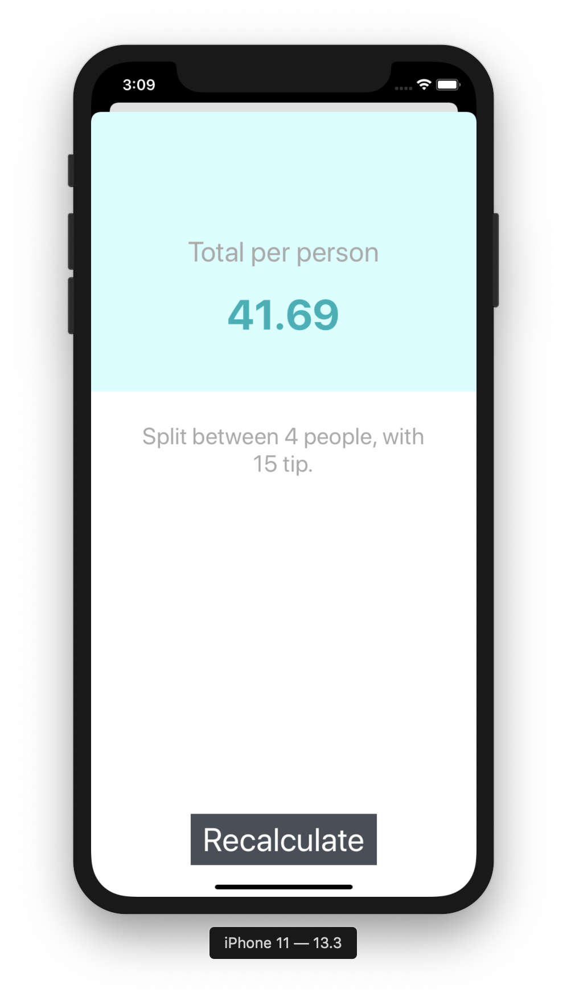

# SplitApp

A simple iOS App build to make easier spliting expenses between people

● UITextfield for inserting the expense price

● UIButtons for diffrent tip percentages (0%, 10%, 15%)

● UIStepper for inserting how many people included in this expense

● MVC (Model View Controller)

● Segue presented Modally (proceedToResults)

● Dismiss the Results View

● Background Colors

● Stack Views and Constraints

 
